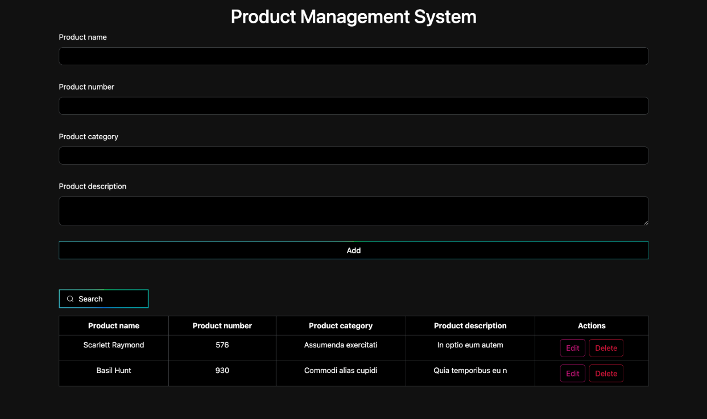

# Product Management System with CRUD Operations 📦
## Overview
This is a simple Product Management System that allows users to perform CRUD (Create, Read, Update, Delete) operations on products. The system is built using HTML, CSS, JavaScript, and Bootstrap for a responsive and user-friendly interface.🍁

## Screenshot


## Features 💠
Create: Add new products with details such as name, price, and description.
Read: View a list of existing products with their details.
Update: Modify the information of existing products.
Delete: Remove unwanted products from the system.
## Technologies Used ⌨️
1. ***HTML:***  Markup language for creating the structure of web pages.
2. ***CSS:*** Stylesheet language for designing the appearance of web pages.
3. ***JavaScript:*** Programming language for implementing dynamic behavior.
4. ***Bootstrap:*** Front-end framework for creating responsive and attractive user interfaces.
Installation
Clone the repository:


Copy code
``` 
git clone https://github.com/your-username/product-management-system.git 
```
Open the project folder:


Copy code
```
cd product-management-system
```
Open index.html in your preferred web browser.

## Usage ❔
- #### Add a Product:
Fill in the required details in the form.
Click "Add" to add the product.
- #### View Products:

The list of existing products is displayed on the main page.
- #### Update a Product:

Click on the "Edit" button next to the product you want to update.
Modify the details in the form.
Click "Update" to update the product.
- #### Delete a Product:

Click on the "Delete" button next to the product you want to remove.
Confirm the deletion.
## Contributing 🤝🏻
Feel free to contribute to the project by creating issues or submitting pull requests. Your feedback and enhancements are welcome!

## License ⚖️
This project is licensed under the MIT License.

## Acknowledgments 🪺
Thanks to Bootstrap for providing a sleek and responsive design.
Special thanks to the open-source community for their valuable contributions.
Happy product managing! 🚀
